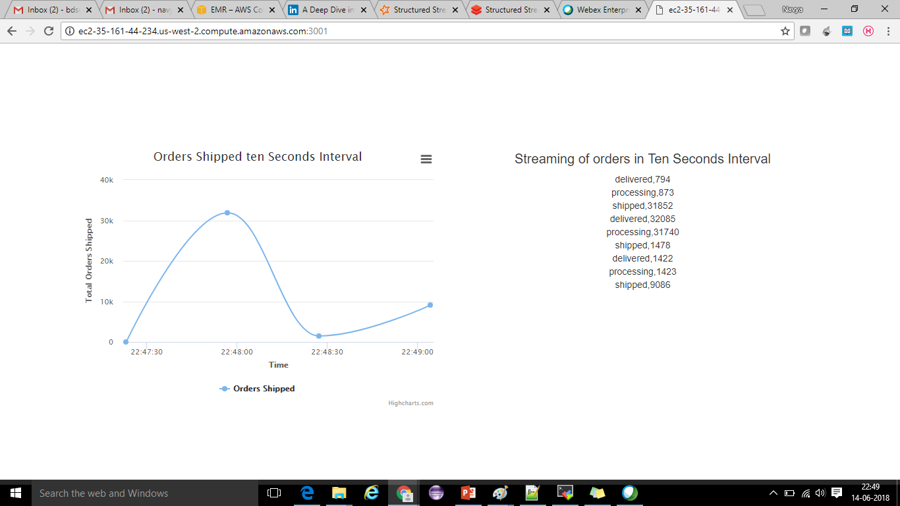
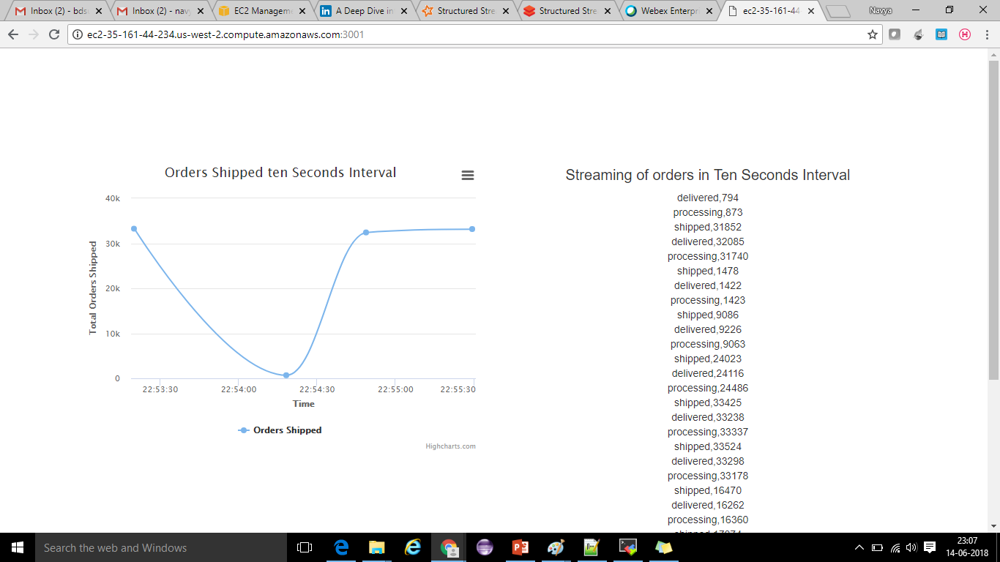

# spark-kafka-nodejs
Building an analytics dashboard using Spark, Kafka, node.js

## Objective

To build an analytics dashboard to visualize number of orders getting shipped in every 10 secs interval of time using Spark, Kafka, node.js

## Data description

1. Dataset contains CSV files comprises shipping details of an e-commerce website.

2. Dataset contains three columns ‘DateTime’, ‘OrderId’ & ‘Status’

   

## Tools and technologies used

Best suited technologies:

1. Apache Kafka
 
2. Apache Spark
 
3. Node.js
 
4. High charts

## EMR Cluster details

Cluster name: Bootcamp-Spark1

EMR version: emr-4.9.4	

DNS: ec2-34-208-176-32.us-west-2.compute.amazonaws.com

Key-pair: ******.pem, ******.ppk

Hostname: ip-172-31-28-92

## Installation steps and commands

### Kafka installation 

1. Install Kafka by typing the below command in your terminal:  

   wget https://archive.apache.org/dist/kafka/0.11.0.0/kafka_2.11-0.11.0.0.tgz  

2. With the help of tar command, untar the downloaded kafka file:  

   tar -xzf kafka_2.11-0.11.0.0.tgz  

3. Now rename the extracted file with the help of mv command: 

   mv kafka_2.11-0.11.0.0 kafka  

4. Finally, you can start your kafka server and create the topics by following the below commands:  

   // Open a terminal and run below zookeeper server command  

   cd kafka 
   bin/zookeeper-server-start.sh config/zookeeper.properties 

   // Open a terminal>navigate to renamed kafka folder> start your kafka server  

   cd kafka  
   bin/kafka-server-start.sh config/server.properties   

   // Open a second terminal and run the below command to create a topic  

   cd kafka 
   bin/kafka-topics.sh --create --zookeeper localhost:2181 --replication-factor 1 --partitions 1 --topic test   

   // Open a third terminal and run your producer of the desired topic  

   cd kafka 
   bin/kafka-console-producer.sh --broker-list localhost:9092 --topic test   

   // Open a fourth terminal and run the consumer  

   cd kafka 
   bin/kafka-console-consumer.sh --bootstrap-server localhost:9092 --topic test 

----------------------------------------------------------------------------------------------------------------------------------------
----------------------------------------------------------------------------------------------------------------------------------------

### Git installation

sudo yum install git

git --version

----------------------------------------------------------------------------------------------------------------------------------------
----------------------------------------------------------------------------------------------------------------------------------------

### Project

// Firstly clone the Spark project from below link

git clone https://github.com/NavyaSreeKanakala/spark-project.git


#### Kafka

// Open a new terminal and run Kafka server using below commands

cd kafka

bin/kafka-server-start.sh config/server.properties   

// Now open another new terminal and create a Kafka topic using below commands

export PATH=$PATH:/home/ec2-user/kafka/bin 
kafka-topics.sh --create --zookeeper localhost:2181 --replication-factor 1 --partitions 1 --topic orders_data

// After topic creation in Kafka, navigate to kafka directory present in the Spark project folder and run the below given script

cd spark-project/spark_dashboard/kafka

vi push_orders_data_in_topic.sh

```

#!/bin/bash

export PATH=$PATH:/home/ec2-user/kafka/bin

FILES=$1/*.csv

for f in $FILES

do
    echo "pushing $f file"
    
    cat $f | kafka-console-producer.sh --broker-list $2  --topic $3
    
    sleep 60

done

```

// Command to run script for pushing data to Kafka

/bin/bash push_orders_data_in_topic.sh ../data/ordersdata ip-172-31-28-92:9092 orders_data

------------------------------------------------------------------------------------------------------------------------------------

#### Spark

// Open a new terminal and create another Kafka topic

export PATH=$PATH:/home/ec2-user/kafka/bin 

kafka-topics.sh --create --zookeeper localhost:2181 --replication-factor 1 --partitions 1 --topic orders_ten_sec_data

// After topic creation, type below command to be a super user

sudo -i

// Navigate to spark directory present in the Spark project folder and submit below python script to Spark

cd /home/ec2-user/spark-project/spark_dashboard/spark

// Install pykafka using below pip command

pip install pykafka

// Open the python script present in Spark folder of project and change the hostname accordingly

vi spark_streaming_order_status.py

```

from pyspark import SparkContext

from pyspark.streaming import StreamingContext

from pyspark.streaming.kafka import KafkaUtils

from pykafka import KafkaClient

import json

import sys

import pprint

def pushOrderStatusInKafka(status_counts):
    
    client = KafkaClient(hosts="ip-172-31-28-92:9092")
    
    topic = client.topics['orders_ten_sec_data']
    
    for status_count in status_counts:
            
            with topic.get_producer() as producer:
                    
                    producer.produce(json.dumps(status_count))

zkQuorum, topic = sys.argv[1:]

sc = SparkContext("local[2]", "KafkaOrderCount")

ssc = StreamingContext(sc, 10)

kvs = KafkaUtils.createStream(ssc, zkQuorum, "spark-streaming-consumer", {topic: 1})

lines = kvs.map(lambda x: x[1])

status_count = lines.map(lambda line: line.split(",")[2]) \
              .map(lambda order_status: (order_status, 1)) \
              .reduceByKey(lambda a, b: a+b)

status_count.pprint()

status_count.foreachRDD(lambda rdd: rdd.foreachPartition(pushOrderStatusInKafka))

ssc.start()

ssc.awaitTermination()

```

// Command to submit the Spark application

spark-submit --jars spark-streaming-kafka-assembly_2.10-1.6.0.jar spark_streaming_order_status.py localhost:2181 orders_data

------------------------------------------------------------------------------------------------------------------------------------

#### Node.js

// Navigate to nodejs directory present in the Spark project folder

cd spark-project/spark_dashboard/nodejs

// Install node.js and some dependencies using below commands

curl --silent --location https://rpm.nodesource.com/setup_8.x | sudo bash -

sudo yum -y install nodejs

npm install express

npm install socket.io

npm install kafka-node

// Below javascript file pull the data from Kafka topic namely orders_ten_sec_data and display results in highcharts

vi index.js

```

var app = require('express')();

var http = require('http').Server(app);

var io = require('socket.io')(http);

var kafka = require('kafka-node');

var HighLevelConsumer = kafka.HighLevelConsumer;

var Offset = kafka.Offset;

var Client = kafka.Client;

var topic = 'orders_ten_sec_data';

var client = new Client('localhost:2181', "worker-" + Math.floor(Math.random() * 10000));

var payloads = [{ topic: topic }];

var consumer = new HighLevelConsumer(client, payloads);

var offset = new Offset(client);

var port = 3001;

app.get('/', function(req, res){
    res.sendfile('index.html');
});

io = io.on('connection', function(socket){
    console.log('a user connected');
    socket.on('disconnect', function(){
        console.log('user disconnected');
    });
});

consumer = consumer.on('message', function(message) {
    console.log(message.value);
    io.emit("message", message.value);
});

http.listen(port, function(){
    console.log("Running on port " + port)
});

```

// Command to run node.js file

node index.js

// After node server is started, go to http://YOUR_WEB_CONSOLE:PORT_NUMBER to access analytics dashboard

http://ec2-34-208-176-32.us-west-2.compute.amazonaws.com:3001/


## Screenshots

// Terminal 1: Data is being pushed to a topic named orders_data

   
   

// Terminal 2: Data is read from topic orders_data by Spark streaming in 10 secs interval & pushed to another Kafka topic namely orders_ten_sec_data

   
   

// Terminal 3: Data is read from topic orders_ten_sec_data and pushed to index.js file

   
   

// Terminal 4: Using socket.io, data is streamed from node.js console to Highcharts

   
   
   
   
   
   
   
   
   
   

## Future Possibilites

1. Similarly we can build more dashboards for analysis such as, 
    
    i) Most purchased products
    
    ii) Most viewed 
    
    For different products using e-commerce data.
 
2. We can also Splunk, Datameer, Tableau for creating dashboards instead of High charts


## Most common errors

// Problem 1: YarnScheduler: Initial job has not accepted any resources; check your cluster UI to ensure that workers are registered and have sufficient resources

// Solution 1: Replace localhost in spark code with cluster hostname(ip-172-31-25-99)
